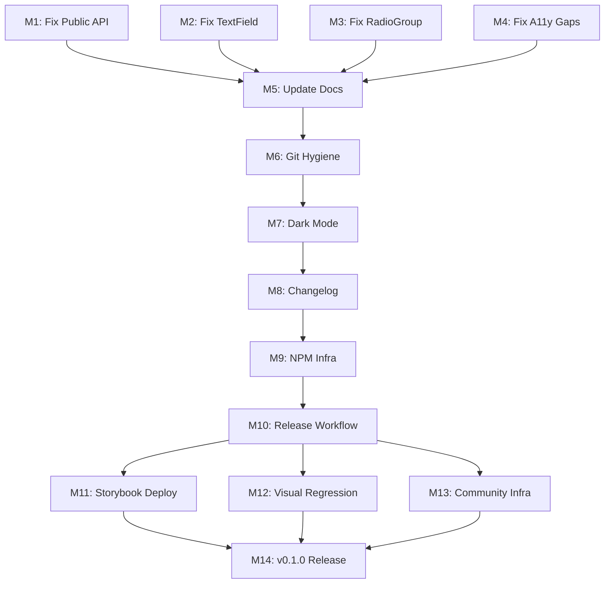

# Phase 0: Release Readiness Milestones

> **Goal:** Bring TinyBigUI from its current state (7 components built, dev branch only) to a published v0.1.0 release on NPM.
>
> **Scope:** Component bug fixes, documentation accuracy, git hygiene, pre-release infrastructure, and final release. Future navigation (Phase 2) and beyond are out of scope.
>
> **Started:** April 2026
> **Target:** v0.1.0 publication

---

## Milestone Index

| #   | Milestone                                                                  | Priority | Effort | Status      | Depends On     |
| --- | -------------------------------------------------------------------------- | -------- | ------ | ----------- | -------------- |
| M1  | [Fix Public API Surface](milestone-01-fix-public-api.md)                   | Critical | S      | Not Started | —              |
| M2  | [Fix TextField Architecture](milestone-02-fix-textfield-architecture.md)   | Critical | M      | Not Started | —              |
| M3  | [Fix RadioGroup Label Bug](milestone-03-fix-radiogroup-label.md)           | High     | S      | Not Started | —              |
| M4  | [Fix Accessibility Gaps](milestone-04-fix-accessibility-gaps.md)           | High     | S      | Not Started | —              |
| M5  | [Update Project Documentation](milestone-05-update-documentation.md)       | High     | S      | Not Started | M1, M2, M3, M4 |
| M6  | [Git Hygiene & Branch Merge](milestone-06-git-hygiene.md)                  | Critical | S      | Not Started | M5             |
| M7  | [Dark Mode System Preference](milestone-07-dark-mode-system-preference.md) | Medium   | S      | Not Started | M6             |
| M8  | [Changelog & Version Management](milestone-08-changelog-versioning.md)     | Critical | S      | Not Started | M7             |
| M9  | [NPM Publishing Infrastructure](milestone-09-npm-publishing-infra.md)      | Critical | S      | Not Started | M8             |
| M10 | [Release Workflow Automation](milestone-10-release-workflow.md)            | Critical | M      | Not Started | M9             |
| M11 | [Storybook Deployment](milestone-11-storybook-deployment.md)               | High     | M      | Not Started | M10            |
| M12 | [Visual Regression Testing](milestone-12-visual-regression-testing.md)     | Medium   | M      | Not Started | M10            |
| M13 | [Community Infrastructure](milestone-13-community-infrastructure.md)       | Medium   | M      | Not Started | M10            |
| M14 | [v0.1.0 Release](milestone-14-v0.1.0-release.md)                           | Critical | S      | Not Started | M11, M12, M13  |

**Effort key:** S = Small (< 1 day), M = Medium (1–2 days), L = Large (3+ days)

---

## Dependency Graph

**Parallelism opportunities:**

- M1, M2, M3, M4 — fully independent, can be worked simultaneously
- M11, M12, M13 — independent from each other, all unblock M14

---

## Current State Summary

The project has been inactive since **February 24, 2026** (7 weeks). Here is what exists:

### Completed Work

| Category                                                                | Status                                             |
| ----------------------------------------------------------------------- | -------------------------------------------------- |
| Monorepo infrastructure (pnpm, TypeScript, Tailwind v4, CI/CD)          | Done                                               |
| MD3 design tokens (colors, typography, elevation, shape, motion)        | Done                                               |
| Shared utilities (`cn`, color helpers, typography helpers, `useRipple`) | Done                                               |
| Vitest + RTL + Storybook setup                                          | Done                                               |
| ESLint + Prettier + Husky + Commitlint                                  | Done                                               |
| Button (53 tests)                                                       | Done                                               |
| IconButton (49 tests)                                                   | Done — not exported from package root              |
| FAB (51 tests)                                                          | Done — not exported from package root              |
| TextField                                                               | Done — architectural drift (not wrapping headless) |
| Checkbox                                                                | Done                                               |
| Switch                                                                  | Done                                               |
| Radio + RadioGroup                                                      | Done — potential label duplication bug             |

### Known Issues

| Issue                                                             | Milestone |
| ----------------------------------------------------------------- | --------- |
| `IconButton` and `FAB` missing from `packages/react/src/index.ts` | M1        |
| `TextField` styled layer does not compose `TextFieldHeadless`     | M2        |
| `RadioGroup` may render the group label twice                     | M3        |
| FAB spinner SVG missing `aria-label="Loading"`                    | M4        |
| ROADMAP.md, TASKS.md, README.md all stale                         | M5        |
| 85 commits on `dev` never merged to `main`                        | M6        |
| No `prefers-color-scheme` dark mode (only `.dark` class)          | M7        |
| No CHANGELOG.md, no Changesets configured                         | M8        |
| No NPM org, no publishing credentials                             | M9        |
| No release automation workflow                                    | M10       |
| Storybook not deployed publicly                                   | M11       |
| No visual regression testing                                      | M12       |
| Missing CODE_OF_CONDUCT.md, SECURITY.md, Dependabot               | M13       |
| v0.1.0 not published                                              | M14       |

---

## Cursor Rules in Effect

All milestones must comply with the following rules from `.cursor/rules/`:

| Rule File              | Applies To                                                    |
| ---------------------- | ------------------------------------------------------------- |
| `architecture.mdc`     | All component work (M2, M3, M4) — three-layer required        |
| `testing.mdc`          | All component work — TDD, axe, >90% coverage                  |
| `code-style.mdc`       | All code — named exports, no `any`, `use client`              |
| `md3-design.mdc`       | All component work — MD3 tokens only, no arbitrary values     |
| `tailwind-v4.mdc`      | Token work (M7) — CSS-first `@theme` config                   |
| `storybook.mdc`        | Story work — required story types, JSDoc                      |
| `release-workflow.mdc` | M6, M8, M9, M10, M14 — branch strategy, semver, quality gates |

---

## Quality Gate (Applies to Every Milestone)

Before closing any milestone:

- [ ] `pnpm lint` passes with zero errors
- [ ] `pnpm typecheck` passes with zero errors
- [ ] `pnpm test` passes with all tests green
- [ ] `pnpm build` succeeds for both packages
- [ ] All commits use Conventional Commits format
